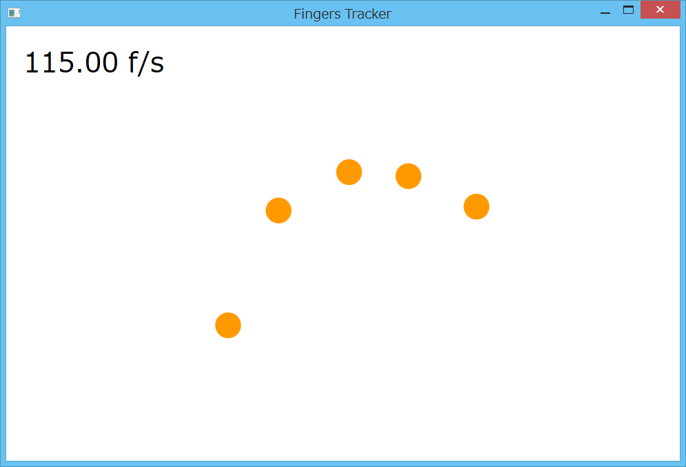

## Tutorials 2014

The samples for tutorial.

### KinectTutorial01 (Depth Monitor)
See [document](https://github.com/sakapon/Tutorials-2014/wiki/KinectTutorial01).

### KinectTutorial02 (Body Tracker)
See [document](https://github.com/sakapon/Tutorials-2014/wiki/KinectTutorial02).

### LeapTutorial01 (Air Canvas)
See [document](https://github.com/sakapon/Tutorials-2014/wiki/LeapTutorial01).

### LeapTutorial02 (Fingers Tracker)
See [document](https://github.com/sakapon/Tutorials-2014/wiki/LeapTutorial02).

